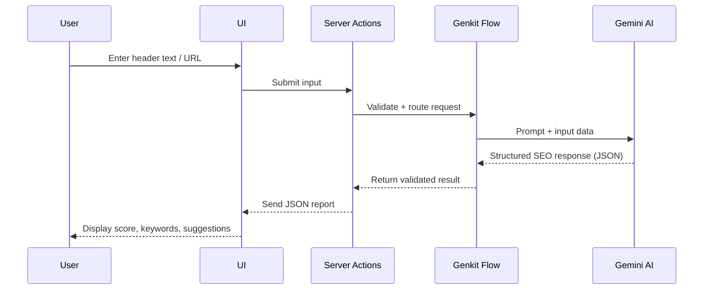

---

## 📘 AI-Powered SEO Analysis Checker

Unlock the power of AI-driven SEO insights with this sleek and powerful Next.js application. Built using **Google Gemini AI** through **Genkit**, this tool offers intelligent recommendations to optimize your meta headers and site content for maximum search visibility.

### 🚀 Key Features

- 🔍 **Text Analysis Mode** – Evaluate how a meta title or description performs against a keyword.
- 🌐 **URL Analysis Mode** – Generate optimized meta tags for any given URL.
- 📊 **SEO Score** – A visual score (0–100) representing your ranking potential.
- 📄 **Actionable Report** – See strengths, weaknesses, and expert suggestions.
- ✅ **Ranking Factor Audit** – Check content against top on-page SEO factors.
- 🗝️ **Keyword Variations** – Discover related keywords, volume, and difficulty metrics.
- 🎨 **Modern UI** – Built with ShadCN UI + Tailwind CSS for a smooth user experience.

---

## 🧠 How It Works

This app follows a modular architecture with a smart separation between the **frontend UI** and the **AI-powered backend logic**.

### Frontend (Next.js + React)

- Collects user input through sleek, interactive forms.
- Displays dynamic SEO reports fetched from the backend.
- Uses `Server Actions` to securely invoke AI-powered analysis flows.

### Backend (Genkit + Gemini AI)

- Defines robust data schemas using Zod.
- Crafts detailed prompts for Gemini to analyze headers and URLs.
- Processes the AI response and returns structured JSON to the frontend.

---

## 📈 API Integration

Here’s a simplified representation of how the system components interact:

---

## 🛠 Tech Stack

| Layer        | Technology           |
|--------------|----------------------|
| Frontend     | Next.js (App Router), React |
| Backend      | Genkit (Google Gemini AI)   |
| Styling      | Tailwind CSS, ShadCN UI     |
| Validation   | Zod                        |
| Language     | TypeScript                 |

---

## 🚀 Getting Started

Make sure you have:

- Node.js ≥ v18
- Your Gemini API key from [Google AI Studio](https://aistudio.google.com/app/apikey)

Then follow the full setup guide included in your repository to get started locally or deploy via GitHub Pages.

---
